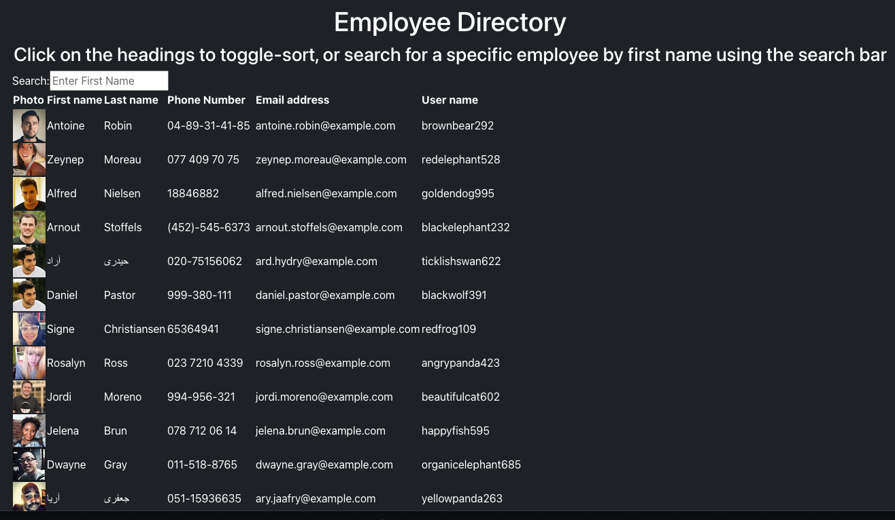

# Employee-Manager

## Description 
* This is a React application that runs with Node.js that allows managers to view their employees.
* It allows to search employees.
* it allows to sort employees by first name.

## Screenshots of the App.

* This is a single page Application: 

## Credits

* The application utilizes React stateless and statefull components.
* All employees are generated from the Random User API.

## License

* unlicensed

## Questions

If you have questions contact me on [GitHub](https://jamirov.github.io/) or contact Jasur at ajasur@gmail.com.